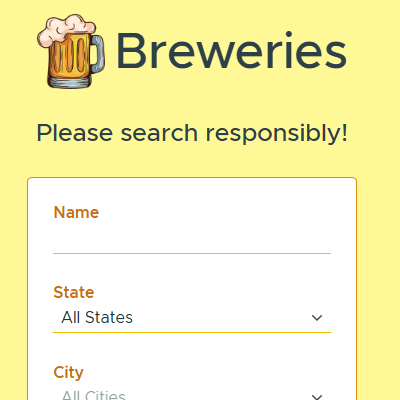

# Breweries

Search breweries in the USA by name, state, city, and type. Find breweries near you using geolocation. Save favorites to local storage.

## Getting Started

1. Clone the repo  
  `git clone https://github.com/nightwolfdev/breweries.git`
2. Navigate to the project folder  
  `cd breweries`
3. Install dependencies  
  `npm install`
4. Run the app  
  `ng serve`
5. Visit the app in a browser  
  `http://localhost:4200`

## Links

* [Demo](https://nightwolfdev.github.io/breweries/)
* [Angular](https://angular.io)
* [Clarity Design System](https://clarity.design/)
* [RxJS](https://rxjs.dev)
* [TypeScript](https://www.typescriptlang.org)
* [Open Brewery DB](https://www.openbrewerydb.org/)